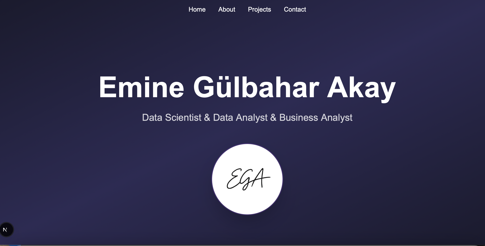

# Emine Gülbahar Akay - Data Analyst & Scientist Portfolio

This is the source code for my personal portfolio website, built with Next.js and Tailwind CSS. The website showcases my projects, skills, and professional background in data science, data analysis, and business analysis.

[](https://your-live-url.vercel.app)

**Live Demo:** [**portfolio-link.vercel.app**](https://your-live-url.vercel.app) *(Deployment pending)*

---

## ✨ Features

- **Responsive Design:** Fully responsive layout that looks great on all devices, from mobile phones to desktops.
- **Project Showcase:** A dedicated section to display my data analysis, machine learning, and visualization projects with descriptions and links.
- **Interactive UI:** Smooth transitions and a clean user interface built with modern web technologies.
- **About Me:** Detailed sections covering my story, work experience, education, and technical skills.
- **Direct Contact:** An easy way to get in touch via email.

---

## 🛠️ Technologies Used

This project was built using the following technologies:

- **Framework:** [Next.js](https://nextjs.org/) (v14+)
- **Language:** [TypeScript](https://www.typescriptlang.org/)
- **Styling:** [Tailwind CSS](https://tailwindcss.com/)
- **Icons:** [React Icons](https://react-icons.github.io/react-icons/)
- **Deployment:** [Vercel](https://vercel.com/)

---

## 🚀 Getting Started

To get a local copy up and running, follow these simple steps.

### Prerequisites

Make sure you have Node.js and npm installed on your machine.
- You can download them from [nodejs.org](https://nodejs.org/).

### Installation

1. **Clone the repository:**
   ```sh
   git clone https://github.com/your-username/your-repository-name.git
   ```
2. **Navigate to the project directory:**
   ```sh
   cd your-repository-name
   ```
3. **Install NPM packages:**
   ```sh
   npm install
   ```
4. **Run the development server:**
   ```sh
   npm run dev
   ```

Open [http://localhost:3000](http://localhost:3000) with your browser to see the result.

---

## Licensing

This project is open-source and available under the [MIT License](LICENSE).

---

## Learn More

To learn more about Next.js, take a look at the following resources:

- [Next.js Documentation](https://nextjs.org/docs) - learn about Next.js features and API.
- [Learn Next.js](https://nextjs.org/learn) - an interactive Next.js tutorial.

You can check out [the Next.js GitHub repository](https://github.com/vercel/next.js) - your feedback and contributions are welcome!

## Deploy on Vercel

The easiest way to deploy your Next.js app is to use the [Vercel Platform](https://vercel.com/new?utm_medium=default-template&filter=next.js&utm_source=create-next-app&utm_campaign=create-next-app-readme) from the creators of Next.js.

Check out our [Next.js deployment documentation](https://nextjs.org/docs/app/building-your-application/deploying) for more details.
